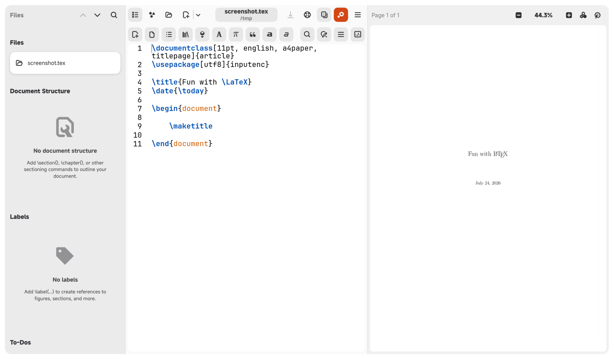

# NeoSetzer

<div align="center">
  
</div>

[简体中文](README.zh-CN.md)

---

Simple yet full-featured LaTeX editor for Linux, Windows, and macOS, written in Python with GTK. (A fork of Setzer.)

> This is a fork of [Setzer](https://github.com/cvfosammmm/Setzer) by cvfosammmm.
> The original project site is <https://www.cvfosammmm.org/setzer/>, licensed under GPL-3.0-or-later.
> This fork is maintained at <https://github.com/Sam-Fic/NeoSetzer>.



NeoSetzer is a LaTeX editor written in Python with GTK. Feedback on design, code architecture, bugs, and feature requests is welcome through this repository's issue tracker.

Based on the original project, a large number of components have been migrated to Libadwaita, which is modern and beautiful.

The UI/UX design has been thoroughly optimized; I hope you’ll appreciate the meticulous details I’ve crafted :)

## Platform Support

NeoSetzer runs on **Linux**, **Windows**, and **macOS** from a single codebase. No platform fork or separate build is required.

| Platform | Status | Runtime stack |
|----------|--------|---------------|
| Linux (Debian/Ubuntu 24.04+, Fedora, Arch, ...) | Fully supported | System GTK4 + libadwaita |
| Windows 10/11 (x86_64) | Supported via MSYS2 | Portable MSYS2 mingw-w64 GTK4 stack |
| macOS Apple Silicon (ARM64) | Supported | Self-contained `.app` release package |
| WSL (Windows Subsystem for Linux) | Supported as Linux app | Linux distribution inside WSL |

> **WebKitGTK note:** The optional help-panel browser (WebKitGTK 6.0) is **not packaged for MSYS2 `mingw64`**, so it cannot be installed on Windows. NeoSetzer detects this at runtime (`HAS_WEBKIT`) and automatically falls back — search still works, only in-app HTML rendering is disabled. This is by design and does not affect LaTeX editing or PDF preview.

## Installation

This fork is **not** published on Flathub. Ways to get it:

1. **Windows portable zip** — `setzer_<version>_windows_x64.zip` in the [GitHub Releases](https://github.com/Sam-Fic/NeoSetzer/releases) of this fork. Extract anywhere and run `mingw64\bin\setzer.bat`; no MSYS2 or installer needed. See [Using the portable zip](#using-the-portable-zip).
2. **Debian/Ubuntu package** — Prebuilt `.deb` packages are published in the [GitHub Releases](https://github.com/Sam-Fic/NeoSetzer/releases) of this fork. Check there for the latest build.
3. **macOS Apple Silicon application** — Download `setzer_<version>_macos_arm64.zip`, extract `Setzer.app`, and see [macOS packaging notes](docs/packaging/macos.md) for the current Gatekeeper and signing status.
4. **Build from source** (see below) — works on any Linux distribution or Windows (via MSYS2) with the dependencies available.

## Running NeoSetzer with GNOME Builder

To run NeoSetzer with GNOME Builder, click the "Clone" button on the start screen, paste `https://github.com/Sam-Fic/NeoSetzer.git`, wait for the clone to finish, and press the play button. GNOME Builder will build NeoSetzer and its dependencies before launching it.

> **Warning:** Building NeoSetzer this way may take a long time.

## Running NeoSetzer on Debian/Ubuntu

NeoSetzer is developed and tested on Ubuntu.

> **Supported distributions:** NeoSetzer requires WebKitGTK 6.0 (gir1.2-webkit-6.0), which is available on **Ubuntu 24.04 (Noble) or newer** and **Debian 13 (trixie) or newer**. On older releases (e.g. Ubuntu 22.04, Debian 12) the `gir1.2-webkit-6.0` package does not exist and the `.deb` cannot be installed there. If you are on an older distribution, build from source as described below — the GTK4/WebKit bindings are resolved at runtime.

1. Run the following command to install prerequisite packages:

   ```bash
   # Run in a Linux terminal
   apt-get install meson ninja-build python3-gi gir1.2-gtk-4.0 gir1.2-gtksource-5 gir1.2-pango-1.0 gir1.2-poppler-0.18 gir1.2-webkit-6.0 gettext python3-cairo python3-gi-cairo gir1.2-adw-1 python3-numpy gir1.2-xdp-1.0
   ```

   > Note: `gir1.2-xdp-1.0` (the libportal GIR) is only used for Linux/Flatpak detection. It is not needed on Windows (see note below).

2. Clone the NeoSetzer repository from GitHub:

   ```bash
   # Run in a Linux terminal
   git clone https://github.com/Sam-Fic/NeoSetzer.git
   ```

3. Change into the NeoSetzer folder:

   ```bash
   # Run in a Linux terminal
   cd NeoSetzer
   ```

4. Run meson:

   ```bash
   # Run in a Linux terminal
   meson setup builddir
   ```

   > Note: Some distributions may not include systemwide installations of Python modules which aren't installed from distribution packages. In this case, you want to install NeoSetzer in your home directory with `meson setup builddir --prefix=~/.local`.

5. Install NeoSetzer with:

   ```bash
   # Run in a Linux terminal
   ninja install -C builddir
   ```

   Or run it locally:

   ```bash
   # Run in a Linux terminal
   ./scripts/dev/setzer.dev
   ```

## Running NeoSetzer on Windows

NeoSetzer supports Windows natively. The GTK4 runtime stack is provided by **MSYS2** (the only reliable source of up-to-date GTK4 / libadwaita / GtkSourceView 5 / Poppler binaries on Windows).

There are two ways to get it running:

- **Portable zip** — the easy way, no MSYS2 required. See directly below.
- **Build from source** — for development or if you want to modify NeoSetzer. See Step 1 onwards.

### Using the portable zip

`setzer_<version>_windows_x64.zip` is a self-contained build (~128 MB, ~349 MB extracted) that bundles Python, GTK4 and every other runtime dependency. Nothing needs to be installed and nothing is written to the registry.

1. Download `setzer_<version>_windows_x64.zip` from the [GitHub Releases](https://github.com/Sam-Fic/NeoSetzer/releases) page.

2. Extract it **anywhere you like** — a USB stick, `D:\Apps\NeoSetzer`, your desktop. There is no fixed installation path.

   > Right-click → "Extract All…" in File Explorer works. So does PowerShell:
   >
   > ```powershell
   > Expand-Archive setzer_74_windows_x64.zip -DestinationPath D:\Apps\NeoSetzer
   > ```

3. Run **`mingw64\bin\setzer.bat`** inside the extracted folder — double-click it in File Explorer, or call it from cmd / PowerShell.

   > **PowerShell note:** run it *without* quotes, or prefix it with the call operator (`& "…\setzer.bat"`). A bare quoted path is treated as a string and only echoed, not executed.

4. To pin it to the taskbar or Start menu, create a shortcut to `setzer.bat` (right-click → "Send to" → "Desktop (create shortcut)").

To uninstall, just delete the folder. Your settings live in `%LOCALAPPDATA%\setzer` (i.e. `C:\Users\<you>\AppData\Local\setzer`) and are kept across versions — remove that folder too if you want a completely clean state.

> **Do I still need MSYS2?** No. Everything is bundled. Do **not** add the extracted `mingw64\bin` to your system `PATH` — if you also have MSYS2 installed, the two GTK4 stacks can shadow each other and cause hard-to-diagnose DLL errors.
>
> **LaTeX is still a separate install.** The zip contains the editor, not a LaTeX distribution — see "Installing a LaTeX distribution on Windows" below.

### Step 1 — Install MSYS2

Download and install MSYS2 from <https://www.msys2.org/>. Open the **MSYS2 MINGW64** shell (not the default `ucrt64`/`clang64` shell unless you know what you are doing — `mingw64` is the tested configuration).

### Step 2 — Install dependencies

In the MSYS2 MINGW64 shell:

```bash
# Run in the MSYS2 MINGW64 shell
pacman -S --needed \
  mingw-w64-x86_64-meson mingw-w64-x86_64-ninja \
  mingw-w64-x86_64-gtk4 mingw-w64-x86_64-libadwaita \
  mingw-w64-x86_64-gtksourceview5 \
  mingw-w64-x86_64-poppler \
  mingw-w64-x86_64-python mingw-w64-x86_64-python-cairo \
  mingw-w64-x86_64-python-gobject \
  mingw-w64-x86_64-python-pip \
  mingw-w64-x86_64-python-numpy \
  gettext
```

> **No `libportal`:** the package `mingw-w64-x86_64-libportal` does **not** exist in MSYS2 — libportal is only packaged for the `msys` subsystem, not `mingw64`. NeoSetzer only uses it (`Xdp`) for Flatpak detection, guarded by `try/except`, so it is simply omitted on Windows.

Then install the **pure-Python** libraries that are not packaged by pacman. MSYS2's Python is externally managed (PEP 668), so the `--break-system-packages` flag is required:

> **`numpy` comes from pacman, not pip.** The MSYS2 MinGW Python reports the platform tag `mingw_x86_64_msvcrt_gnu`, so upstream `win_amd64` wheels (including numpy's) do **not** match — `pip install numpy` falls back to a source build and fails/succeeds only after a very long compile. Always install `numpy` (and any other C-extension package such as `scipy`, `pillow`, …) via pacman as `mingw-w64-x86_64-python-<name>` instead.
>
> **Use the MinGW Python, not the MSYS one.** Make sure `python` resolves to `/mingw64/bin/python` (`python -c "import sys; print(sys.platform)"` should print `win32`). If `pip`/`python` point at the `msys` interpreter instead, PyGObject and the pacman-installed `numpy` won't be found. Prefer `python -m pip …` to be explicit.

### Step 3 — Clone and configure

```bash
# Run in the MSYS2 MINGW64 shell
git clone https://github.com/Sam-Fic/NeoSetzer.git
cd NeoSetzer
meson setup builddir
```

### Step 4 — Run (development mode)

```bash
# Run in cmd / PowerShell (no MSYS2 needed)
scripts\dev\setzer.dev.bat
```

`scripts\dev\setzer.dev.bat` is the recommended Windows launcher — a thin wrapper that adds the source tree to `PYTHONPATH` (the `setzer` package is not installed into `site-packages`) and prepends `mingw64\bin` to `PATH` so the correct Python and the GTK4 / libadwaita DLLs are found, then runs the meson-built `builddir\setzer_dev.py`. It works from cmd, PowerShell, or a double-click in File Explorer, with no MSYS2 shell required.

> **PowerShell note:** run it *without* quotes. A quoted path (`"scripts\dev\setzer.dev.bat"`) is treated as a string and is only echoed, not executed.

Cross-platform alternative (run from the MSYS2 MINGW64 shell) — this is the path used to validate the build in this fork:

```bash
# Run in the MSYS2 MINGW64 shell
python scripts/dev/setzer.dev
```

> A bare `python builddir\setzer_dev.py` fails with `ModuleNotFoundError: No module named 'setzer'` unless `PYTHONPATH` is set first — prefer the `.bat` or `python scripts/dev/setzer.dev`.

### Step 5 — Install (optional)

```bash
# Run in the MSYS2 MINGW64 shell
ninja install -C builddir
```

This installs `setzer.bat` (and the Python `setzer` script) into the MSYS2 `bin/` directory. After installation you can launch NeoSetzer by running `setzer` from any MSYS2 shell, or by adding `<MSYS2>\mingw64\bin` to your system `PATH` and running `setzer.bat` from cmd / PowerShell / Windows Terminal.

### Installing a LaTeX distribution on Windows

To build documents from within the app, install one of:

- [MiKTeX](https://miktex.org/) (Windows-native, recommended)
- [TeX Live](https://www.tug.org/texlive/) (cross-platform)
- [Tectonic](https://tectonic-typesetting.github.io/) (single-binary, automatic dependency download)

Make sure the LaTeX engine you choose (`pdflatex`, `xelatex`, `lualatex`, or `tectonic`) is on your `PATH`, then pick it in the "Preferences" dialog under "LaTeX Interpreter".

## Building your documents from within the app

To build your documents from within the app you have to install a LaTeX interpreter. For example if you want to build with XeLaTeX, on Ubuntu this can be installed like so:
`apt-get install texlive-xetex`

To specify a build command open the "Preferences" dialog and choose the command you want to use under "LaTeX Interpreter".

## Packaging

### Debian/Ubuntu (`.deb`)

See [docs/packaging/debian.md](docs/packaging/debian.md) for the Debian package and release workflow.

### Windows (portable zip / installer)

See [docs/packaging/windows.md](docs/packaging/windows.md) for the Windows portable-package workflow, and [docs/packaging/macos.md](docs/packaging/macos.md) for the macOS application-package workflow.

## Getting in touch

Development and discussion for this fork take place on GitHub at [https://github.com/Sam-Fic/NeoSetzer](https://github.com/Sam-Fic/NeoSetzer "project url").
For the original upstream project, see [https://github.com/cvfosammmm/setzer](https://github.com/cvfosammmm/setzer).

## Acknowledgements

NeoSetzer draws some inspiration from other LaTeX editors. For example the symbols in the sidebar are mostly the same as in LaTeXila, though I continue to change / reorganize them. The autocomplete suggestions are mostly the same as in Texmaker. I took some icons from Gnome Builder. Syntax highlighting schemes are based on the Tango scheme in GtkSourceView and the Gnome Builder Scheme.

Parts of the user interface are modeled after [GNOME Text Editor](https://gitlab.gnome.org/GNOME/gnome-text-editor).

## License

NeoSetzer is licensed under GPL version 3 or later. See the COPYING file for details.
